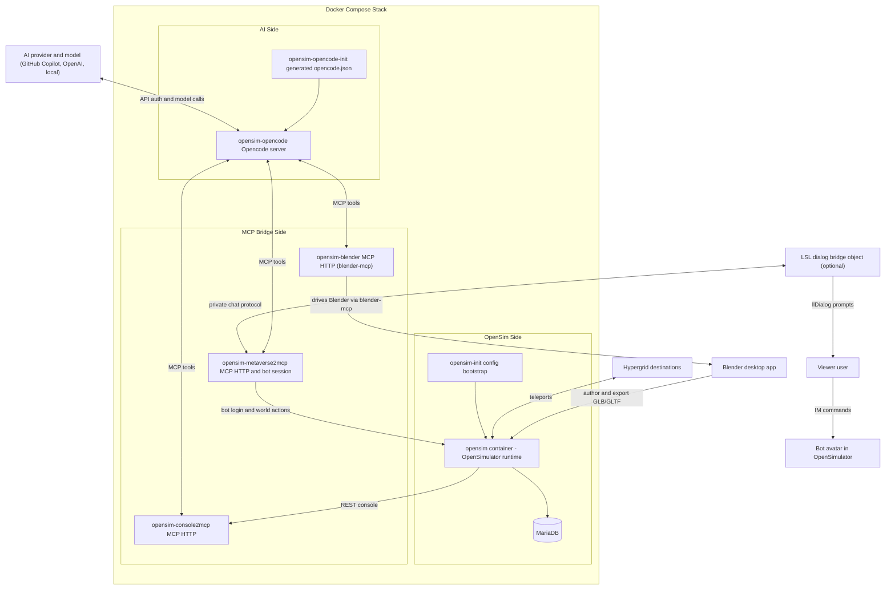

# Architecture Diagram

This diagram shows how the stack components fit together, including the database, hypergrid, Blender content authoring, dialog bridge, and external AI provider/model.

## Data flow summary

1. You send bot instructions via in-world IM.
2. `opensim-metaverse2mcp` routes the text to Opencode chat sessions.
3. Opencode decides which MCP tools to call.
4. Tool calls go to `opensim-console2mcp` (server admin), `opensim-metaverse2mcp` (in-world actions), or `opensim-blender` (3D authoring tools).
5. Results return back through Opencode and are sent to you in-world.

!!! tip "Bridge script is optional"
    The LSL dialog bridge is optional. Without it, permission questions still appear in IM and can be answered with star commands.
